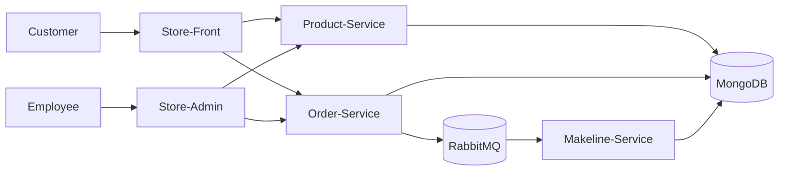

# Final Project: Cloud-Native App for Best Buy

## Architecture Diagram



## Application Overview

The Best Buy Cloud-Native Application is a microservices-based system designed to simulate a modern retail platform running in the cloud. The application allows customers to browse products and place orders through a web interface, while employees can manage inventory and view order activity through an administrative dashboard. All components are containerized and deployed to a Kubernetes cluster hosted on Azure Kubernetes Service (AKS).

The system is built using multiple independent services that communicate with each other over HTTP and message queues. Product and order data are stored in a MongoDB database configured as a StatefulSet to ensure persistence. RabbitMQ is used to handle asynchronous messaging between services, allowing orders to be processed in the background without blocking the user interface. This architecture improves reliability, scalability, and separation of responsibilities between services.

The application includes two front-end interfaces: a Store-Front for customers and a Store-Admin dashboard for employees. When a customer places an order, the Order-Service saves the order in the database and sends a message to RabbitMQ. The Makeline-Service listens for these messages, verifies inventory availability, updates product stock levels, and changes the order status accordingly. This event-driven workflow reflects how real-world cloud applications handle background processing.

The entire system is deployed using Kubernetes resources such as Deployments, Services, ConfigMaps, Secrets, and StatefulSets. Continuous Integration and Continuous Deployment (CI/CD) pipelines automatically build Docker images and push them to Docker Hub, enabling consistent and repeatable deployments. Overall, the application demonstrates key cloud-native concepts including containerization, microservices, asynchronous messaging, persistent storage, and automated deployment in a production-like environment.

## Deployment Instructions

**Prerequisites**

Ensure the following tools and accounts are installed/accesible:
- Docker Desktop
- Kubernetes CLI (kubectl)
- Azure CLI (az)
- Docker Hub account
- Azure account with AKS access
  
These docker images should be pushed to Docker Hub
```
thomas4806/bestbuy-store-front
thomas4806/bestbuy-store-admin
thomas4806/bestbuy-product-service
thomas4806/bestbuy-order-service
thomas4806/bestbuy-makeline-service
```
1. Create the cluster (via Azure Portal or CLI), then connect:
```
az aks get-credentials \
  --resource-group cst8915-final-rg \
  --name bestbuy-cluster \
  --overwrite-existing
```
```
az aks get-credentials --resource-group cst8915-final-rg --name bestbuy-cluster --overwrite-existing
```

This can be verified with:
` kubectl get nodes`

2. Prepare Kubernetes Deployment Files
All deployment files are in this repository in the "Deployment Files" folder. These include:
- secrets.yaml
- mongodb-statefulset.yaml
- rabbitmq-deployment.yaml
- configmap.yaml
- product-service-deployment.yaml
- order-service-deployment.yaml
- makeline-service-deployment.yaml
- store-front-deployment.yaml
- store-admin-deployment.yaml

3. Deploy Infrastructure:
```
kubectl apply -f "Deployment Files/secrets.yaml"
kubectl apply -f "Deployment Files/mongodb-statefulset.yaml"
kubectl apply -f "Deployment Files/rabbitmq-deployment.yaml"
kubectl apply -f "Deployment Files/configmap.yaml"
```
This can be verified with:
```
kubectl get pods
kubectl get pvc
```
This should show the mongoDB, rabbitMQ and storage are running.

4. Deploy Backend Services:
```
kubectl apply -f "Deployment Files/product-service-deployment.yaml"
kubectl apply -f "Deployment Files/order-service-deployment.yaml"
kubectl apply -f "Deployment Files/makeline-service-deployment.yaml"
```
This can be verified with:
```
kubectl get pods
kubectl get svc
```

5. Deploy Front-End Applications:
```
kubectl apply -f "Deployment Files/store-front-deployment.yaml"
kubectl apply -f "Deployment Files/store-admin-deployment.yaml"
```
This can be verified with:
```
kubectl get svc
```
6. Update Front-End Environmental Variables if Required:
The Store-Front and Store-Admin applications use environment variables at build time. If the API endpoint structure changes, update the .env files in the front-end repositories and rebuild the images before redeploying.
Example .env file:
```
VUE_APP_PRODUCT_SERVICE_URL=/api
VUE_APP_ORDER_SERVICE_URL=/api
```
After rebuilding and pushing updated images to Docker Hub, restart the deployments:
```
kubectl rollout restart deployment store-front
kubectl rollout restart deployment store-admin
```

7. Seed Product Data
The AKS MongoDB instance starts empty, so product data must be added before the application can be used.

Port-forward the Product-Service:
`kubectl port-forward svc/product-service 3030:3030`
Then send POST requests to add products, for example: 
```
POST http://localhost:3030/products
Content-Type: application/json

{
  "id": "p1001",
  "name": "Gaming Mouse",
  "category": "Accessories",
  "brand": "Logitech",
  "price": 79.99,
  "stock": 25
}
```
8. Access the Application
Once deployment is complete, use the external IPs from `kubectl get svc` to access the front end applications.
Example:
```
http://<store-front-external-ip>
http://<store-admin-external-ip>
```


## GitHub Links:

- Order Service: https://github.com/thomas7carriere/CST8915_OrderService_Final
- Product Service: https://github.com/thomas7carriere/CST8915_ProductService_Final
- Store Front: https://github.com/thomas7carriere/cst8915-store-front-final
- Store Admin: https://github.com/thomas7carriere/cst8915-store-admin-final
- Make-Line Service: https://github.com/thomas7carriere/cst8915-makeline-service-final

## DockerHub Links:

- Order Service: https://hub.docker.com/repository/docker/thomas4806/bestbuy-order-service
- Product Service: https://hub.docker.com/repository/docker/thomas4806/bestbuy-product-service
- Store Front: https://hub.docker.com/repository/docker/thomas4806/bestbuy-store-front
- Store Admin: https://hub.docker.com/repository/docker/thomas4806/bestbuy-store-admin
- Make-Line Service: https://hub.docker.com/repository/docker/thomas4806/bestbuy-makeline-service

## Video Demo
https://youtu.be/gsgcOgrGRek  (So sorry! My headset died before I could sign off and thank you for watching my demo)


AI Disclosure: AI was used to help with troubleshooting and making changes to baseline project. Also used to help reword some readme documentation
