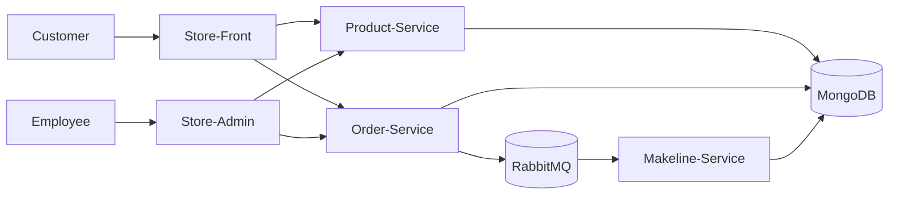

# Final Project: Cloud-Native App for Best Buy

## Architecture Diagram

## Application Overview

The Best Buy Cloud-Native Application is a microservices-based system designed to simulate a modern retail platform running in the cloud. The application allows customers to browse products and place orders through a web interface, while employees can manage inventory and view order activity through an administrative dashboard. All components are containerized and deployed to a Kubernetes cluster hosted on Azure Kubernetes Service (AKS).

The system is built using multiple independent services that communicate with each other over HTTP and message queues. Product and order data are stored in a MongoDB database configured as a StatefulSet to ensure persistence. RabbitMQ is used to handle asynchronous messaging between services, allowing orders to be processed in the background without blocking the user interface. This architecture improves reliability, scalability, and separation of responsibilities between services.

The application includes two front-end interfaces: a Store-Front for customers and a Store-Admin dashboard for employees. When a customer places an order, the Order-Service saves the order in the database and sends a message to RabbitMQ. The Makeline-Service listens for these messages, verifies inventory availability, updates product stock levels, and changes the order status accordingly. This event-driven workflow reflects how real-world cloud applications handle background processing.

The entire system is deployed using Kubernetes resources such as Deployments, Services, ConfigMaps, Secrets, and StatefulSets. Continuous Integration and Continuous Deployment (CI/CD) pipelines automatically build Docker images and push them to Docker Hub, enabling consistent and repeatable deployments. Overall, the application demonstrates key cloud-native concepts including containerization, microservices, asynchronous messaging, persistent storage, and automated deployment in a production-like environment.

## Deployment Instructions

## GitHub Links:

- Order Service: https://github.com/thomas7carriere/CST8915_OrderService_Final
- Product Service: https://github.com/thomas7carriere/CST8915_ProductService_Final
- Store Front: https://github.com/thomas7carriere/cst8915-store-front-final
- Store Admin: https://github.com/thomas7carriere/cst8915-store-admin-final
- Make-Line Service: https://github.com/thomas7carriere/cst8915-makeline-service-final

## DockerHub Links:

- Order Service: https://hub.docker.com/repository/docker/thomas4806/bestbuy-order-service
- Product Service: https://hub.docker.com/repository/docker/thomas4806/bestbuy-product-service
- Store Front: https://hub.docker.com/repository/docker/thomas4806/bestbuy-store-front
- Store Admin: https://hub.docker.com/repository/docker/thomas4806/bestbuy-store-admin
- Make-Line Service: https://hub.docker.com/repository/docker/thomas4806/bestbuy-makeline-service

## Video

AI Disclosure: AI was used to help with troubleshooting and making changes to baseline project. Also used to help write some readme documentation
